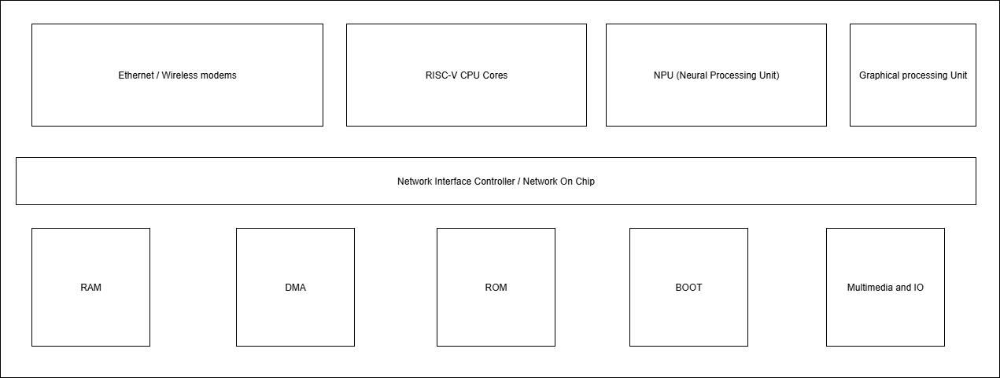

# RISC-V Reference SoC Tapeout Program - Theory & Conceptual Understanding

## Overview

The RISC-V Reference SoC Tapeout Program focuses on designing and implementing a compact, open-source **System-on-Chip (SoC)** called **BabySoC**, built around the RVMYTH RISC-V processor core. This educational platform integrates essential analog and digital components to demonstrate real-world SoC design principles and serves as a stepping stone toward understanding complex semiconductor design flows.



---

## What is a System-on-Chip (SoC)?

A **System-on-Chip (SoC)** is an integrated circuit that consolidates all essential components of a computer system onto a single semiconductor die. Unlike traditional computer architectures that use separate chips for different functions, an SoC combines the processor, memory, input/output interfaces, and specialized processing units into one compact package.

### Key Advantages of SoC Design:
- **Space Efficiency**: Dramatically reduces the physical footprint of electronic systems
- **Power Optimization**: Minimizes power consumption through integrated design and shorter interconnects
- **Cost Reduction**: Lower manufacturing costs due to fewer discrete components
- **Performance Enhancement**: Reduced latency between components improves overall system speed
- **Reliability**: Fewer interconnections result in higher system reliability

---

## Components of a Typical SoC

### 1. **Central Processing Unit (CPU)**
The computational heart of the SoC, responsible for:
- Executing instruction sets and managing system operations
- Coordinating data flow between different subsystems
- In BabySoC: **RVMYTH** - a RISC-V based processor core

### 2. **Memory Subsystem**
- **RAM (Random Access Memory)**: Temporary data storage for active operations
- **ROM/Flash Memory**: Non-volatile storage for firmware and configuration data
- **Cache Memory**: High-speed buffer memory for frequently accessed data

### 3. **Input/Output (I/O) Peripherals**
- Communication interfaces (UART, SPI, I2C)
- General-purpose input/output (GPIO) pins
- Specialized interfaces for external device connectivity

### 4. **Clock Generation and Management**
- **Phase-Locked Loop (PLL)**: Generates stable, synchronized clock signals
- Clock distribution networks ensuring timing coherency across the chip
- In BabySoC: **8x PLL** for precise clock generation and control

### 5. **Analog-Digital Interface Components**
- **Digital-to-Analog Converters (DAC)**: Convert digital signals to analog outputs
- **Analog-to-Digital Converters (ADC)**: Convert analog inputs to digital signals
- In BabySoC: **10-bit DAC** for interfacing with external analog systems

### 6. **Interconnect Fabric**
- On-chip buses and communication protocols
- Network-on-Chip (NoC) for complex multi-core designs
- Ensures efficient data transfer between components

---

## Why BabySoC is a Simplified Model for Learning

### Educational Focus
BabySoC serves as an ideal learning platform because it:

1. **Manageable Complexity**: Contains essential SoC components without overwhelming beginners
2. **Open-Source Foundation**: Based on RISC-V architecture, promoting transparency and learning
3. **Real-World Application**: Demonstrates practical digital-to-analog interfacing
4. **Documentation Rich**: Highly documented design facilitating understanding


### Core Learning Objectives
- **Digital Design Principles**: Understanding processor architecture and operation
- **Analog-Digital Integration**: Learning how digital systems interface with analog devices
- **Clock Domain Management**: Appreciating the importance of synchronized timing
- **System Integration**: Combining multiple IP cores into a cohesive system

### Practical Applications
BabySoC's DAC enables communication with consumer electronics:
- Converting digital audio signals for speakers and headphones
- Generating analog video signals for displays
- Interfacing with analog sensors and actuators

---

## The Role of Functional Modelling in SoC Design

### Design Flow Hierarchy
The SoC design process follows a structured approach:

```
System Specification → Functional Modeling → RTL Design → Physical Implementation → Tapeout
```

### Functional Modelling Phase
**Purpose**: Validate system architecture and functionality before detailed implementation

**Key Activities**:
1. **Behavioral Modeling**: Define how each component should behave
2. **Interface Specification**: Establish communication protocols between modules
3. **Performance Analysis**: Evaluate timing and throughput requirements
4. **Verification Planning**: Develop test strategies for system validation

### Benefits Before RTL Implementation
- **Early Bug Detection**: Identify architectural issues before costly RTL development
- **Performance Optimization**: Optimize system-level performance characteristics
- **Interface Refinement**: Perfect communication protocols between components
- **Risk Mitigation**: Reduce design risks through early validation

### Transition to Physical Design
Functional models provide the foundation for:
- **RTL Development**: Detailed hardware description language implementation
- **Synthesis**: Converting RTL to gate-level representations
- **Physical Design**: Layout, routing, and timing closure for manufacturing

---

## BabySoC in the Learning Journey

### Educational Progression
1. **Conceptual Understanding**: Grasp SoC fundamentals and component interactions
2. **Functional Modeling**: Develop and validate system behavior models
3. **RTL Implementation**: Create detailed hardware descriptions
4. **Verification**: Comprehensive testing and validation procedures
5. **Physical Design**: Layout and timing optimization for manufacturing

### Skills Development
Through the BabySoC project, students develop:
- **System-level thinking**: Understanding complex system interactions
- **Digital design expertise**: Proficiency in hardware description languages
- **Analog-digital integration**: Knowledge of mixed-signal design principles
- **Verification methodologies**: Comprehensive testing and validation techniques

### Industry Relevance
The knowledge gained from BabySoC directly applies to:
Smartphone and tablet processors
Connected device implementations
Advanced driver assistance systems
Smart home and entertainment devices

---

## Conclusion

BabySoC, provides an exceptional foundation for understanding modern semiconductor design. By combining essential SoC components in a manageable, well-documented package, it bridges the gap between theoretical knowledge and practical implementation. The progression from functional modeling through physical design mirrors industry practices, preparing students for careers in semiconductor design and embedded systems development.

This educational approach ensures that learners not only understand individual components but also appreciate the complex interactions and design trade-offs that characterize successful SoC implementations in today's technology landscape.

---

