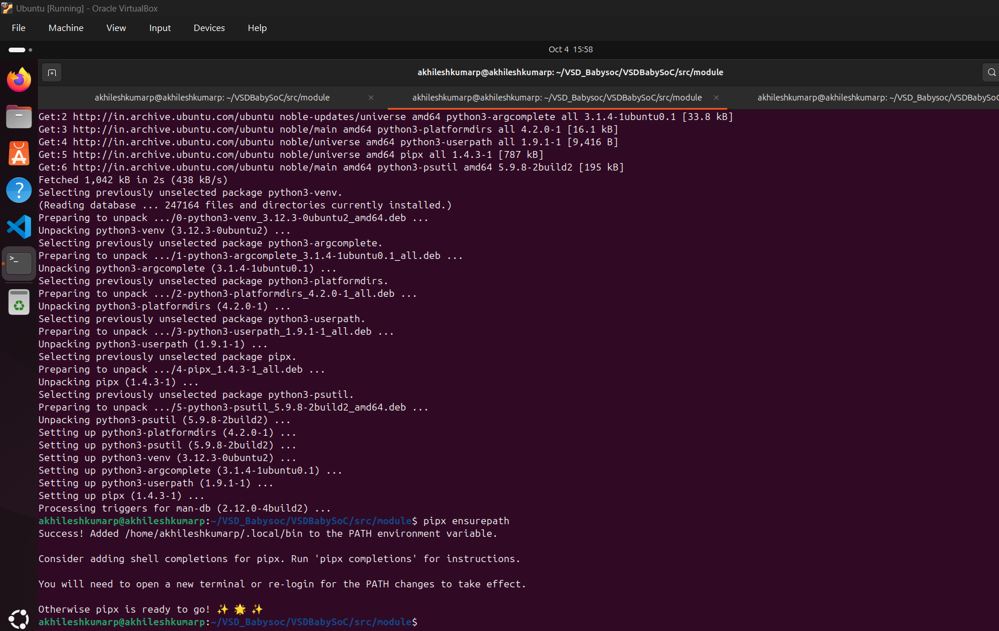
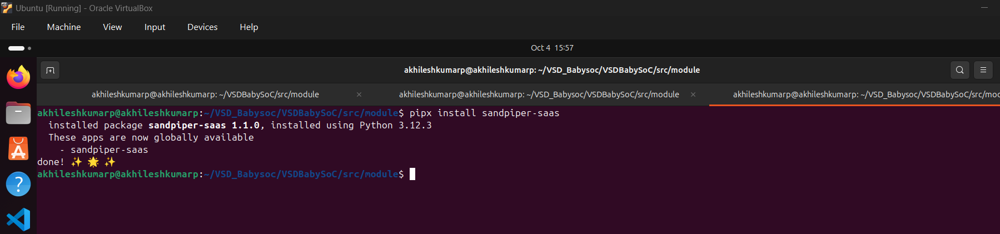
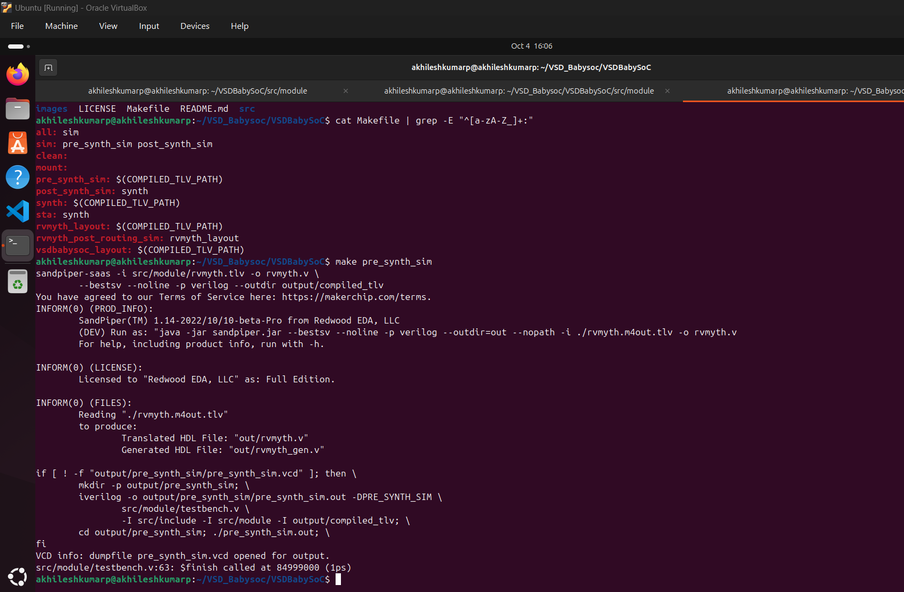
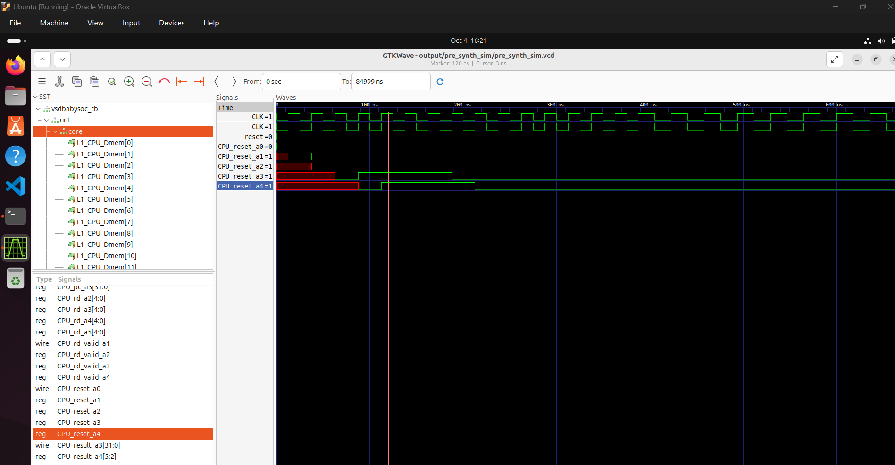
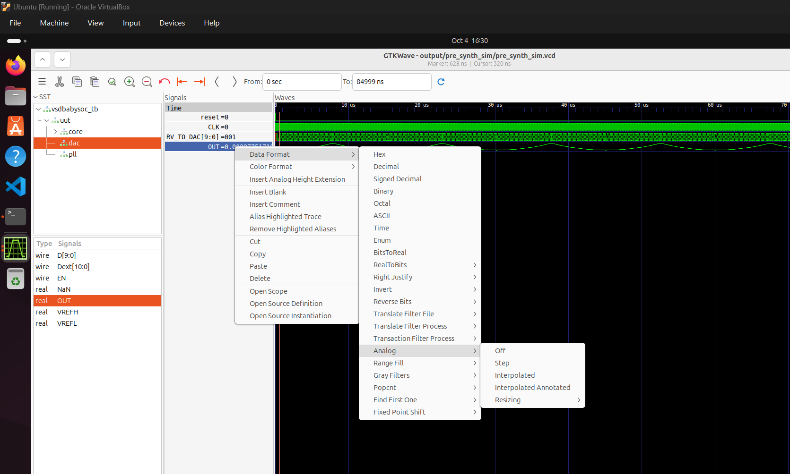
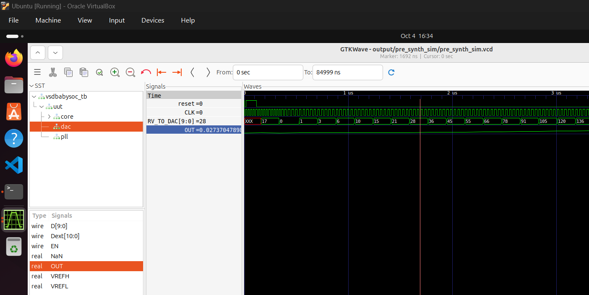

# Functional Modelling of VSDBabySoC

## Introduction to Functional Modelling

Functional modeling is the first crucial step in any SoC design process where we define and validate the behavior of our system before diving into the complexities of RTL design. Think of it as creating a blueprint that shows how all the components will work together, what data flows between them, and how they'll respond to different inputs.

In the context of VSDBabySoC, functional modeling helps us understand how the RVMYTH processor, PLL, and DAC will interact as a complete system. This step saves us from costly mistakes later in the design flow and ensures our architecture meets the intended specifications.

---

## Understanding VSDBabySoC Architecture

VSDBabySoC is designed as a compact yet powerful learning platform that demonstrates real-world SoC concepts. The system consists of three main components that work together to process digital data and convert it into analog outputs suitable for external devices.

### Core Components Overview

**RVMYTH Processor**: This is our main processing unit based on the RISC-V architecture. It's not just any processor - it's specifically designed to be educational and open-source, making it perfect for understanding CPU fundamentals. The processor handles data processing tasks and maintains values in its registers, particularly using the `r17` register for our specific application.

**Phase-Locked Loop (PLL)**: The PLL serves as our timing backbone. Without proper timing, digital systems fall apart quickly. The PLL takes a reference clock signal and generates a stable, synchronized clock that keeps all our components working in harmony. It's like having a conductor for an orchestra - everything needs to stay in sync.

**Digital-to-Analog Converter (DAC)**: This component bridges the digital and analog worlds. It takes the processed digital values from RVMYTH and converts them into analog signals that can drive real-world devices like speakers, displays, or other analog systems.

---

## System Operation Flow

### Step 1: Initialization and Clock Setup
When VSDBabySoC powers up, the first thing that happens is clock initialization. The PLL receives an external reference signal and begins generating the stable clock that will synchronize all operations. This isn't just flipping a switch - the PLL needs time to lock onto the reference frequency and stabilize.

During this phase, the system ensures that all components are ready to receive the clock signal. The timing requirements are critical here because any jitter or instability in the clock can cause data corruption or system malfunctions.

### Step 2: RVMYTH Processing Cycle
Once the clock is stable, RVMYTH begins its processing operations. The processor follows a typical fetch-decode-execute cycle, but with a specific focus on generating data for the DAC. Here's what happens:

The processor loads initial values and begins executing its program. As it processes instructions, it updates the `r17` register with new data values. These values aren't random - they're carefully calculated to produce meaningful analog outputs when converted by the DAC.

The beauty of using RVMYTH is that we can program it to generate various types of waveforms or data patterns. Whether we want a sine wave, square wave, or more complex signals, the processor can calculate and output the appropriate digital values.

### Step 3: Data Transfer and Conversion
The processed data from RVMYTH's `r17` register gets transferred to the DAC. This transfer needs to be perfectly timed with the system clock to ensure data integrity. The DAC receives these 10-bit digital values and converts them into corresponding analog voltage levels.

The 10-bit resolution means we can represent 1024 different voltage levels, providing decent precision for most educational and demonstration purposes. The converted analog signal is then available at the output for connection to external devices.

---

## Component Deep Dive

### RVMYTH Functional Behavior
RVMYTH operates on the RISC-V instruction set architecture, which emphasizes simplicity and modularity. In our functional model, we need to define:

- **Instruction Processing**: How the CPU fetches, decodes, and executes instructions
- **Register Management**: Particularly how `r17` is used for DAC data
- **Memory Operations**: How the processor interacts with system memory
- **Timing Requirements**: Clock cycles needed for different operations

The processor doesn't just run arbitrary code - it's programmed specifically to generate data patterns that will result in meaningful analog outputs. This might involve mathematical calculations, lookup tables, or algorithmic generation of waveforms.

### PLL Functional Requirements
The PLL's job might seem simple, but it's actually quite complex. Our functional model needs to account for:

- **Lock Time**: How long it takes the PLL to achieve stable output
- **Frequency Accuracy**: How closely the output matches the desired frequency
- **Jitter Performance**: How stable the output timing is
- **Power Considerations**: How the PLL affects overall system power consumption

In real implementations, PLLs can be sensitive to temperature, voltage variations, and electromagnetic interference. Our functional model helps us understand these dependencies and plan for robust operation.

### DAC Conversion Process
The DAC takes digital input values and converts them to analog voltages. Our functional model defines:

- **Conversion Speed**: How quickly each digital value is converted
- **Output Range**: The voltage range of the analog output
- **Linearity**: How accurately the output voltage represents the input value
- **Settling Time**: How long it takes for the output to stabilize after a new input

---

## System Integration Challenges

### Timing Synchronization
One of the biggest challenges in SoC design is keeping everything synchronized. In VSDBabySoC, we need to ensure that:

- RVMYTH updates `r17` at the right time
- The DAC samples the new value when it's stable
- All operations happen within the allocated clock cycles

Our functional model helps us identify potential timing violations before we commit to hardware implementation.

### Data Flow Management
Data needs to flow smoothly from RVMYTH through to the DAC output. This involves:

- **Data Validation**: Ensuring RVMYTH produces valid 10-bit values
- **Interface Protocol**: Defining how data is transferred between components
- **Error Handling**: What happens if invalid data is produced

### Power and Performance Trade-offs
Every SoC design involves balancing power consumption with performance. Our functional model helps us understand:

- How fast we can run the system clock
- What happens if we reduce voltage to save power
- Whether we can implement power-saving modes

---

## Verification and Testing Strategy

### Functional Verification Approach
Before moving to RTL implementation, we need to thoroughly verify our functional model.
## Transition to RTL Design

### What Functional Modeling Provides
A good functional model gives us several crucial inputs for RTL design:

- **Detailed Specifications**: Exact requirements for each component
- **Interface Definitions**: How components communicate
- **Timing Constraints**: Critical timing requirements that must be met
- **Test Cases**: Scenarios that the RTL implementation must pass

---

STEPS for simulation: 
pre req installation for verilog from tlv files

    ├── module
    │   ├── avsddac.v
    │   ├── avsdpll.v
    │   ├── clk_gate.v
    │   ├── pseudo_rand_gen.sv
    │   ├── pseudo_rand.sv
    │   ├── rvmyth_gen.v
    │   ├── rvmyth.tlv
    │   ├── rvmyth.v
    │   ├── testbench.rvmyth.post-routing.v
    │   ├── testbench.v
    │   └── vsdbabysoc.v

├── output
│   ├── compiled_tlv
│   │   ├── rvmyth_gen.v
│   │   └── rvmyth.v
│   └── pre_synth_sim
│       ├── pre_synth_sim.out
│       └── pre_synth_sim.vcd

The VCD dump can be found here: [pre_synth_sim.vcd](../Simulation_assets/pre_synth_sim.vcd)

Reset flow along with clock can be seen below 

make the analog interpolate to get analog wave of OUT signal of the DAC

## Conclusion

Functional modeling of VSDBabySoC provides the foundation for successful hardware implementation. By understanding how RVMYTH, PLL, and DAC work together, we can design and verify a system that meets its specifications before investing in costly RTL development and physical implementation.

This approach not only saves time and resources but also gives us confidence that our final hardware will work as intended. The lessons learned from VSDBabySoC functional modeling apply directly to real-world SoC design projects, making this an invaluable educational experience.

The journey from functional model to working silicon is complex, but starting with a solid functional foundation makes all the subsequent steps more manageable and successful.