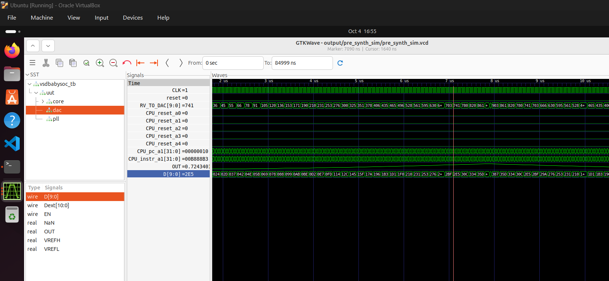
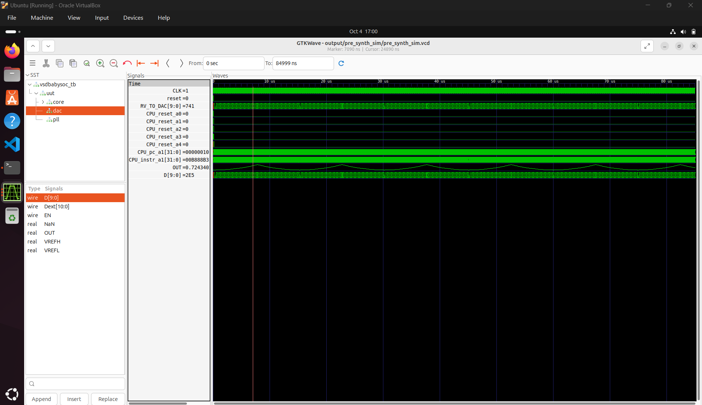

# Functional Modelling of VSDBabySoC

## Introduction to Functional Modelling

Functional modeling is the first crucial step in any SoC design process where we define and validate the behavior of our system before diving into the complexities of RTL design. Think of it as creating a blueprint that shows how all the components will work together, what data flows between them, and how they'll respond to different inputs.

In the context of VSDBabySoC, functional modeling helps us understand how the RVMYTH processor, PLL, and DAC will interact as a complete system. This step saves us from costly mistakes later in the design flow and ensures our architecture meets the intended specifications.

---

## Understanding VSDBabySoC Architecture

VSDBabySoC is designed as a compact yet powerful learning platform that demonstrates real-world SoC concepts. The system consists of three main components that work together to process digital data and convert it into analog outputs suitable for external devices.

### Core Components Overview

**RVMYTH Processor**: This is our main processing unit based on the RISC-V architecture. It's not just any processor - it's specifically designed to be educational and open-source, making it perfect for understanding CPU fundamentals.

**Phase-Locked Loop (PLL)**: The PLL serves as our timing backbone. Without proper timing, digital systems fall apart quickly. The PLL takes a reference clock signal and generates a stable, synchronized clock that keeps all our components working in harmony. 

**Digital-to-Analog Converter (DAC)**: This component bridges the digital and analog worlds. It takes the processed digital values from RVMYTH and converts them into analog signals that can drive real-world devices like speakers, displays, or other analog systems.

## Component Deep Dive

### RVMYTH Functional Behavior
RVMYTH operates on the RISC-V instruction set architecture, which emphasizes simplicity and modularity. In our functional model, we need to define:

- **Instruction Processing**: How the CPU fetches, decodes, and executes instructions
- **Register Management**: Particularly how `r17` is used for DAC data
- **Memory Operations**: How the processor interacts with system memory
- **Timing Requirements**: Clock cycles needed for different operations

The processor doesn't just run arbitrary code - it's programmed specifically to generate data patterns that will result in meaningful analog outputs. This might involve mathematical calculations, lookup tables, or algorithmic generation of waveforms.

### PLL Functional Requirements
The PLL's job might seem simple, but it's actually quite complex. Our functional model needs to account for:

- **Lock Time**: How long it takes the PLL to achieve stable output
- **Frequency Accuracy**: How closely the output matches the desired frequency
- **Jitter Performance**: How stable the output timing is
- **Power Considerations**: How the PLL affects overall system power consumption

In real implementations, PLLs can be sensitive to temperature, voltage variations, and electromagnetic interference. Our functional model helps us understand these dependencies and plan for robust operation.

### DAC Conversion Process
The DAC takes digital input values and converts them to analog voltages. Our functional model defines:

- **Conversion Speed**: How quickly each digital value is converted
- **Output Range**: The voltage range of the analog output
- **Linearity**: How accurately the output voltage represents the input value
- **Settling Time**: How long it takes for the output to stabilize after a new input


## Verification and Testing Strategy

### Functional Verification Approach
Before moving to RTL implementation, we need to thoroughly verify our functional model.

---

**Below we can see the steps followed for functional simulation:** 

**clone the BabySoC project repo**
iverilog and gtkwave are pre installed as per week0 task.

**Pre requisite - installation of Sandpiper for verilog from tlv files**
Install pipx to create virtual env for snadpiper. 


Install Sandpiper to convert tlv files to verilog files.


Get the verilog files using sandpiper from the tlv files.
below are the generated files. 

rvmyth_gen.v

rvmyth.v

Generate RVMYTH Verilog from TLV: 

```terminal
akhileshkumarp@akhileshkumarp:~/VSD_Babysoc/VSDBabySoC$ make pre_synth_sim
sandpiper-saas -i src/module/rvmyth.tlv -o rvmyth.v \
	--bestsv --noline -p verilog --outdir output/compiled_tlv
You have agreed to our Terms of Service here: https://makerchip.com/terms.
INFORM(0) (PROD_INFO):
	SandPiper(TM) 1.14-2022/10/10-beta-Pro from Redwood EDA, LLC
	(DEV) Run as: "java -jar sandpiper.jar --bestsv --noline -p verilog --outdir=out --nopath -i ./rvmyth.m4out.tlv -o rvmyth.v
	For help, including product info, run with -h.

INFORM(0) (LICENSE):
	Licensed to "Redwood EDA, LLC" as: Full Edition.

INFORM(0) (FILES):
	Reading "./rvmyth.m4out.tlv"
	to produce:
		Translated HDL File: "out/rvmyth.v"
		Generated HDL File: "out/rvmyth_gen.v"

if [ ! -f "output/pre_synth_sim/pre_synth_sim.vcd" ]; then \
	mkdir -p output/pre_synth_sim; \
	iverilog -o output/pre_synth_sim/pre_synth_sim.out -DPRE_SYNTH_SIM \
		src/module/testbench.v \
		-I src/include -I src/module -I output/compiled_tlv; \
	cd output/pre_synth_sim; ./pre_synth_sim.out; \
fi
VCD info: dumpfile pre_synth_sim.vcd opened for output.
src/module/testbench.v:63: $finish called at 84999000 (1ps)
```


    ├── module
    │   ├── avsddac.v
    │   ├── avsdpll.v
    │   ├── clk_gate.v
    │   ├── pseudo_rand_gen.sv
    │   ├── pseudo_rand.sv
    │   ├── rvmyth_gen.v
    │   ├── rvmyth.tlv
    │   ├── rvmyth.v
    │   ├── testbench.rvmyth.post-routing.v
    │   ├── testbench.v
    │   └── vsdbabysoc.v


**Compile and Simulate iVerilog using Makefile**


├── output
│   ├── compiled_tlv
│   │   ├── rvmyth_gen.v
│   │   └── rvmyth.v
│   └── pre_synth_sim
│       ├── pre_synth_sim.out
│       └── pre_synth_sim.vcd


**The VCD dump can be found here:** [pre_synth_sim.vcd](../Simulation_assets/pre_synth_sim.vcd)


Reset flow along with clock can be seen below 


make the analog interpolate to get analog wave of OUT signal of the DAC


Overall simulation zoomed view looks like below



Overall simulation fit view looks like below



## Conclusion

Functional modeling of VSDBabySoC provides the foundation for successful hardware implementation. By understanding how RVMYTH, PLL, and DAC work together, we can design and verify a system that meets its specifications before investing in costly RTL development and physical implementation.

This approach not only saves time and resources but also gives us confidence that our final hardware will work as intended. The lessons learned from VSDBabySoC functional modeling apply directly to real-world SoC design projects, making this an invaluable educational experience.

The journey from functional model to working silicon is complex, but starting with a solid functional foundation makes all the subsequent steps more manageable and successful.